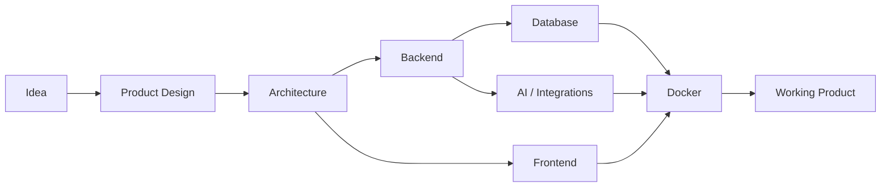

<div align="center">

# Hey, I'm Ivan 👋

### Full-Stack & AI Developer

**Building AI-powered products, backend systems and modern web applications.**

I turn ideas into complete working products — from polished interfaces and APIs
to AI pipelines, automation systems, databases and deployment.

<br>

[](https://github.com/ehala69)
[](https://t.me/gangchell)


<br>


</div>

---

## 👨‍💻 About Me

I'm a **Full-Stack & AI Developer** interested in building complete products rather than isolated pieces of software.

I enjoy taking an idea from the first prototype all the way to a working application:

**idea → architecture → frontend → backend → database → AI → integrations → deployment**

My main focus is creating useful software that combines **strong product thinking, modern web technologies, backend engineering and applied AI**.

* 🤖 Building **AI-powered applications, assistants and automation systems**
* ⚙️ Developing backend services and REST APIs with **Python, FastAPI and Go**
* 🌐 Creating modern web applications with **Next.js, React and TypeScript**
* 🧠 Working with **LLMs, speech processing, AI pipelines and structured AI analysis**
* 🗄️ Building applications around **PostgreSQL, Redis and asynchronous workers**
* 🐳 Containerizing and running applications with **Docker & Docker Compose**
* 🔌 Integrating **Telegram bots, AI providers and external APIs**
* 📊 Building **dashboards, CRM systems, admin panels and analytics interfaces**
* 🚀 Turning prototypes into complete, production-oriented **MVPs**
* 🧪 Constantly experimenting with new technologies and product ideas

---

# 🧩 What I Build

<table>
<tr>
<td width="50%" valign="top">

### 🤖 AI Systems

AI-powered products built around modern language and machine learning models.

**Examples:**

* LLM applications
* AI assistants
* AI automation
* Speech-to-text systems
* Speaker diarization
* Emotion analysis
* Structured LLM outputs
* AI-powered analytics
* Intelligent business workflows

</td>

<td width="50%" valign="top">

### ⚙️ Backend Systems

Backend services designed around real application requirements.

**Examples:**

* REST APIs
* Authentication
* PostgreSQL
* Redis
* Background workers
* Queues
* File processing
* Business logic
* Third-party integrations
* Role-based access

</td>
</tr>

<tr>
<td width="50%" valign="top">

### 🌐 Web Applications

Modern interfaces focused on usability, performance and good visual design.

**Examples:**

* SaaS dashboards
* Admin panels
* CRM interfaces
* Corporate websites
* E-commerce
* Landing pages
* Analytics dashboards
* Responsive applications

</td>

<td width="50%" valign="top">

### 🚀 Product Engineering

I like building the entire product instead of focusing on only one layer.

**Typical stack:**

`Frontend`

↓

`Backend API`

↓

`Database`

↓

`Background Jobs`

↓

`AI / External Services`

↓

`Docker / Deployment`

</td>
</tr>
</table>

---

# 🚀 Featured Projects

## 🎙️ CallAI

### AI-Powered Call Intelligence Platform

A full-stack platform for automatically processing and analyzing call-center conversations.

Instead of simply transcribing audio, CallAI runs recordings through a complete AI processing pipeline and transforms conversations into structured business insights.

### 🧠 AI Pipeline

```text
Call Audio
    ↓
Audio Preprocessing
    ↓
Speech-to-Text
    ↓
Speaker Diarization
    ↓
Operator / Client Identification
    ↓
Emotion Analysis
    ↓
LLM Quality Analysis
    ↓
Findings & Recommendations
    ↓
Analytics Dashboard
```

### ✨ Features

* Audio upload and storage
* Asynchronous audio processing
* FFmpeg preprocessing
* Speech recognition with **Faster-Whisper**
* Speaker diarization with **Pyannote**
* Operator/client role identification
* Manual speaker-role correction
* Emotion analysis with **Emotion2Vec**
* Structured LLM-generated QA reports
* Findings and recommendations
* Call quality metrics
* Analytics dashboards
* Operator management
* Admin and manager roles
* Background processing
* Retryable processing jobs
* Authentication
* Object storage with MinIO

### 🛠 Stack

`Python` · `FastAPI` · `PostgreSQL` · `SQLAlchemy` · `Alembic` · `Redis` · `Celery` · `MinIO`

`Next.js` · `React` · `TypeScript`

`Faster-Whisper` · `Pyannote` · `Emotion2Vec` · `OpenRouter`

`FFmpeg` · `Docker` · `Docker Compose`

### 🔗 Repository

[](https://github.com/ehala69/callai-public)

---

## 🤖 AI Manager

### AI-Assisted Wholesale Sales Manager

AI Manager combines an intelligent assistant, CRM workflows and Telegram automation into a single sales-management system.

The system helps businesses process incoming requests, work with leads, answer product-related questions and manage customer communication.

### ✨ Features

* AI-assisted customer communication
* Product and catalog-grounded answers
* Lead management
* Lead status tracking
* Follow-up reminders
* Telegram bot integration
* Operator dashboard
* CRM workflows
* Google Sheets synchronization
* PostgreSQL persistence
* Redis infrastructure
* AI response generation
* Dockerized architecture

### 🛠 Stack

`Python` · `FastAPI` · `PostgreSQL` · `Redis`

`Next.js` · `React` · `TypeScript`

`Telegram Bot API` · `OpenRouter` · `Google Sheets API`

`Docker` · `Docker Compose`

### 🔗 Repository

[](https://github.com/ehala69/ai-manager)

---

## 🎯 CheckLeads

### Lead Qualification & Management Platform

A full-stack platform for collecting, organizing and qualifying leads with Telegram and AI-assisted workflows.

The project combines a traditional lead-management system with automation and AI integrations.

### ✨ Features

* Lead collection
* Lead management
* Qualification workflows
* Lead status tracking
* Operator dashboard
* Telegram integration
* AI-assisted processing
* Google Sheets integration
* REST backend API
* Database persistence
* External API integrations

### 🛠 Stack

`Python` · `FastAPI` · `SQLAlchemy`

`Next.js` · `React` · `TypeScript`

`Telegram Bot API` · `OpenRouter` · `Google Sheets API`

### 🔗 Repository

[](https://github.com/ehala69/checkleads)

---

## 🛒 Marketplace

### Full-Stack E-Commerce Platform

A reusable e-commerce platform designed as a foundation for real online stores and marketplace-style products.

This project also gives me an opportunity to explore **Go backend development** and build application infrastructure outside my primary Python stack.

### ✨ Features

* Product catalog
* Public categories API
* Public products API
* Product management
* Category management
* Shopping cart
* Checkout flow
* Order CRM
* Delivery management
* Admin authentication
* Argon2id password hashing
* Server-side sessions
* HttpOnly cookies
* CSRF protection
* Product image management
* Telegram order notifications
* Store settings
* Theme settings
* Reverse proxy
* Dockerized deployment

### 🛠 Stack

`Go` · `chi` · `pgx`

`PostgreSQL` · `Redis`

`Next.js` · `React` · `TypeScript` · `Tailwind CSS`

`Caddy` · `Docker` · `Docker Compose`

### 🔗 Repository

[](https://github.com/ehala69/free-marketplace-GO)

---

# 🎨 Frontend & Creative Projects

Alongside backend and AI systems, I enjoy experimenting with visual design, interaction and motion.

| Project                                                                | Description                                 | Stack                               |
| ---------------------------------------------------------------------- | ------------------------------------------- | ----------------------------------- |
| 🏗️ [**Atlas Construction**](https://github.com/ehala69/atlascons)     | Multilingual corporate construction website | Next.js · TypeScript · Tailwind CSS |
| 💐 [**Fleure**](https://github.com/ehala69/fleure)                     | Luxury flowers & gifts e-commerce concept   | Next.js · React · shadcn/ui         |
| 🏎️ [**1967 Ford Mustang**](https://github.com/ehala69/mustangpremium) | Cinematic automotive landing experience     | Next.js · GSAP · TypeScript         |

---

# 🛠️ Tech Stack

## 💻 Languages

<p>
  
</p>

`Python` · `TypeScript` · `JavaScript` · `Go` · `SQL`

---

## 🌐 Frontend

<p>
  
</p>

`Next.js` · `React` · `TypeScript` · `Tailwind CSS` · `shadcn/ui` · `GSAP`

---

## ⚙️ Backend

<p>
  
</p>

`FastAPI` · `SQLAlchemy` · `Alembic` · `REST API` · `Go` · `chi` · `pgx`

---

## 🗄️ Databases & Storage

<p>
  
</p>

`PostgreSQL` · `Redis` · `MinIO`

---

## 🤖 AI / ML

<p>


</p>

### AI areas I've worked with

* LLM API integrations
* Structured LLM output
* AI-assisted business workflows
* Speech recognition
* Speaker diarization
* Audio processing
* Emotion recognition
* AI analytics
* Prompt engineering
* AI-powered automation

---

## 🐳 DevOps & Infrastructure

<p>
  
</p>

`Docker` · `Docker Compose` · `Linux` · `Git` · `GitHub` · `Caddy`

---

## 🔌 APIs & Integrations

<p>


</p>

---

# 🧠 Areas I'm Interested In

```text
🤖 Applied Artificial Intelligence
🧠 AI Agents & Automation
🎙️ Speech & Audio Intelligence
👁️ Computer Vision
⚙️ Backend Engineering
🏗️ Software Architecture
🚀 Product Engineering
🧰 Developer Tools
☁️ SaaS Platforms
📊 Data & Analytics
🔐 Application Security
⚡ High-Performance Backend Systems
```

---

# 🔬 Currently Exploring

I'm constantly learning new technologies and experimenting with different approaches to product development.

```text
AI Systems           ███████████████████░
Backend Engineering  ██████████████████░░
Product Development  ███████████████████░
System Design        ███████████████░░░░░
Go                   ████████████░░░░░░░░
Computer Vision      ███████████░░░░░░░░░
```

### Current focus

* Building more advanced **AI-native applications**
* Improving **backend architecture and system design**
* Exploring **Go for backend systems**
* Working with **AI agents and automation**
* Experimenting with **Computer Vision**
* Building complete products instead of isolated demos

---

# 🏗️ How I Like to Build Products



My preferred approach is simple:

> **Build something that works, test it with real users, improve the architecture as the product grows.**

---

# 📊 GitHub Activity

<div align="center">


</div>

<br>

<div align="center">


</div>

---

# 📫 Contact Me

Interested in collaborating, discussing an idea or building something together?

<div align="center">

[](https://t.me/gangchell)

[](https://github.com/ehala69)

</div>

---

<div align="center">

## Build. Experiment. Ship. 🚀

I enjoy working on ambitious **AI, backend and web products**
and turning ideas into real working software.

### Open to interesting projects, opportunities and collaboration.

<br>

[](https://t.me/gangchell)
[](https://github.com/ehala69?tab=repositories)

</div>
